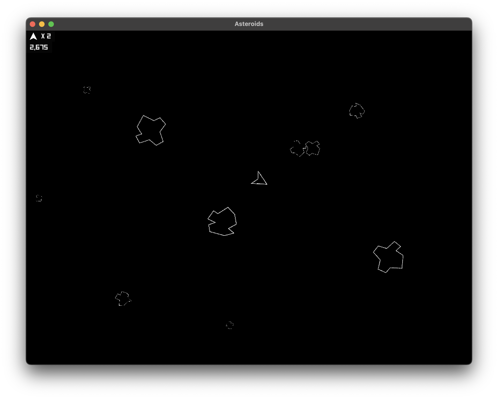
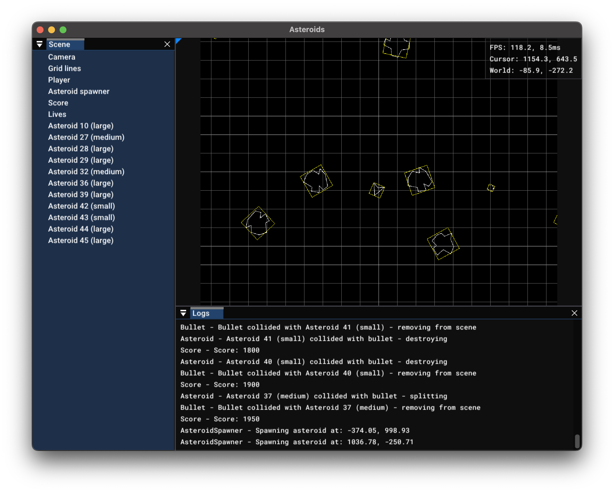

Red Horizon Unity Asteroids
===========================

Using Red Horizon to build the [Asteroids in Unity tutorial](https://www.youtube.com/watch?v=cIeWhztKyAg)

Installation
------------

Requires Java 25 and is tested on macOS Sequoia and Windows 11.

(I'll work on getting a pre-built binary version at some point, but for now you
need to build the project to run it.)

1. Clone this repository
2. Then either open the project in an IDE and run the main method of the
	 `Asteroids` class, or from a terminal you can run `./gradlew run`.

How to play
-----------

The current control scheme is:
 - The ship will rotate towards the mouse cursor, so use your mouse to steer
 - Press `W` to move towards the cursor
 - Use either `Space` or `Mouse button 1` to fire

Debug controls:
 - `I` to toggle debug information panels - a list of objects in the scene and
   a log output - both of which can be docked to the edges of the window
 - `O` to toggle the FPS counter
 - `P` to turn on all of the above, including showing grid lines on the scene
   and collision boxes around objects that are collidable
 - `V` to cycle through vsync options
    - On Windows this will cycle through 1/1, 1/2, 1/3, 1/4, and no vsync
    - On macOS this will only enable/disable vsync

